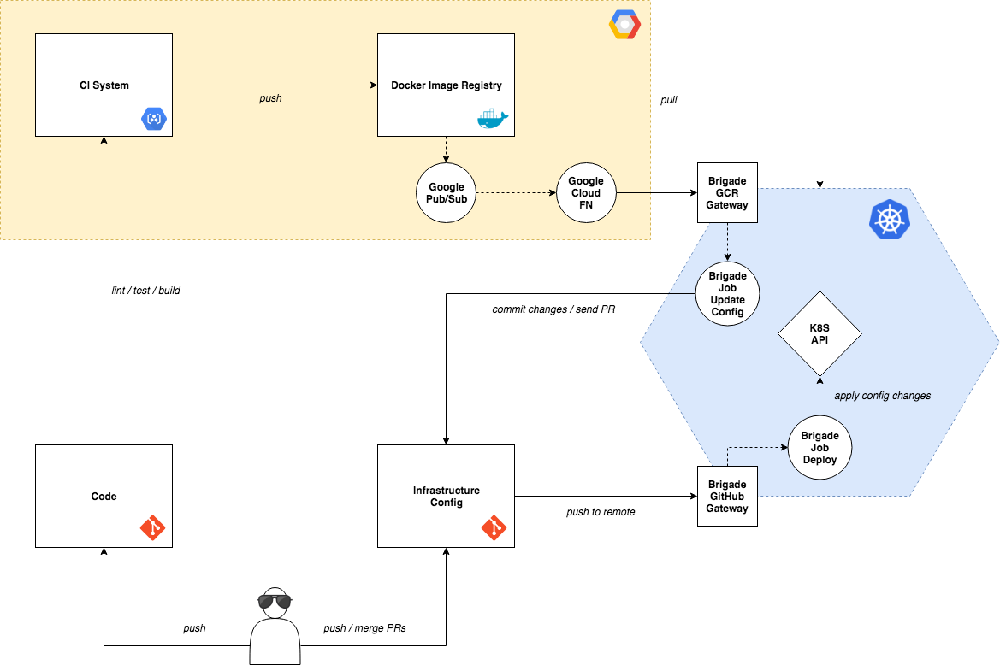

# GitOps Hello World Brigade

Second iteration of the Hello world REST API used to demonstrate a more decoupled GitOps workflow
using [Brigade](https://brigade.sh/) as the CD system.

This workflow uses [Google Container Builder](https://cloud.google.com/container-builder/) as the
CI system to build Docker images and push them to [Google Container Registry](https://cloud.google.com/container-registry/) (GCR). The push to GCR triggers a [Google Cloud Function](https://github.com/danillouz/brigade-gcr-gateway/tree/master/gcf-pubsub)
which sends an HTTP request to the [Brigade GCR Gateway](https://github.com/danillouz/brigade-gcr-gateway).
The Brigade GCR Gateway emits [Brigade Events](https://github.com/Azure/brigade/blob/master/docs/topics/design.md#the-operators-view)
that update corresponding infrastructure configuration repositories. Finally, a push to the infrastructure
remote triggers a Brigade Job that applies the changes to the k8s cluster.

In effect, Brigade is used as the CD system in this workflow.

## Workflow



### Remarks and Questions

* Brigade is a very powerfull, but also a complex tool, with a lot of moving parts. This makes it more difficult to maintain a correct mental model when creating, maintaining and debugging pipelines, as well as onboarding engineers to this workflow.
* Developer Experience isn't great, a lot of fragmenting tooling, especially with Google Cloud (GCR and Cloud Functions).
* Complexity of the setup will make it more difficult to make it highly available.
* Can't use npm modules in brigade scripts.
* Shows a lot of promise and potential, but it's still very young technology.
* Observability is crucial to know if a deploy can move to the next stage; we need dashboards.
* There're no cleanup policies for staging; after a branch has been merged to master or removed.
* There's no way to be alerted when the cluster state diverges from the desired state stored in Git.
* Only way to rollback a change now is by reverting a commit in an infra repo.
* This workflow doesn't include Helm charts; how do they fit in?

## Infrastructure Config

* [Staging](https://github.com/crowdynews/gitops-hello-world-brigade-infra-staging)
* [Production](https://github.com/crowdynews/gitops-hello-world-brigade-infra-production)

## Running locally

```
npm i && npm start
```

The following env vars can be set:

| PROPERTY   | REQUIRED | DEFAULT VALUE                   |
| ---------- | -------- | ------------------------------- |
| `API_HOST` | no       | `0.0.0.0` set in `./src/app.js` |
| `API_PORT` | no       | `8888` set in `./src/app.js`    |

## Caveats

### Google Identity & Access Management Roles

GCP IAM requires `[PROJECT_ID]@cloudbuild.gserviceaccount.com` to have the following roles:

* Cloud Container Builder
